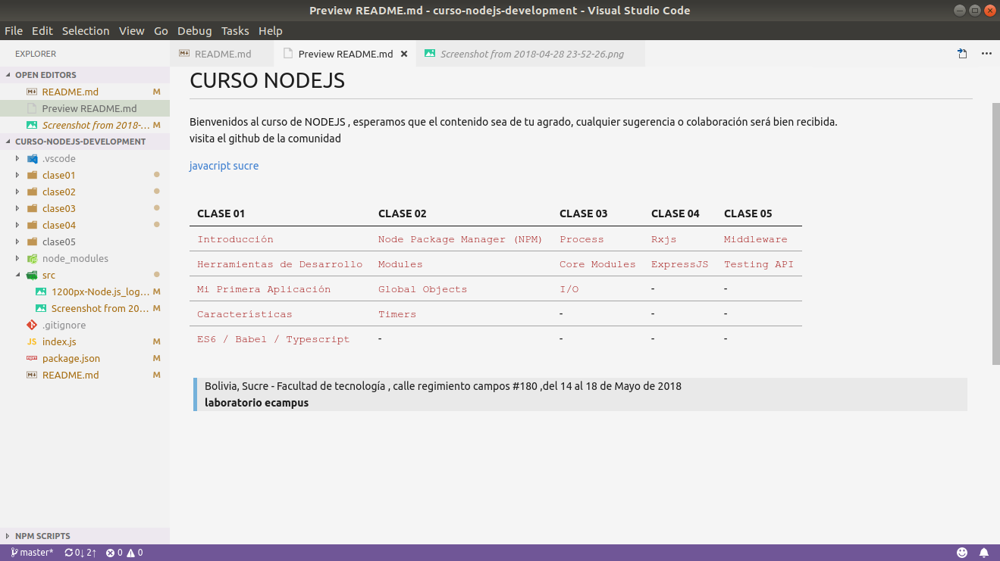

# CURSO DE NODEJS

<p>Bienvenidos al curso de NODEJS , esperamos que el contenido sea de 
tu agrado, cualquier sugerencia o colaboración será bien recibida.
<br>
visita el github de la comunidad

[javacript sucre](http://www.github.com/javascript-sucre)
</p>


<br>

| CLASE 01 |CLASE 02 |CLASE 03 |CLASE 04 |CLASE 05 |
|:--- | :--- | :--- | :--- | :--- |
| `Introducción` | `Node Package Manager (NPM)`| `Process`| `Rxjs` | `Middleware`|
| `Herramientas de Desarrollo` | `Modules` | `Core Modules`| `ExpressJS` | `Testing API`|
| `Mi Primera Aplicación` | `Global Objects`| `I/O` | - | - | - |
| `Características` | `Timers` | - | -  | - |
| `ES6 / Babel / Typescript` | - | -  | - | - | -  |

<br>

> Bolivia, Sucre - Facultad de tecnología , calle regimiento campos #180 ,del 14 al 18 de Mayo de 2018 , <b>laboratorio ecampus</b>

<br>

## TERMINAL - CMD

abrir terminal <strong>CTRL+ALT+T</strong>

```sh
# clona el repositorio del curso NODEJS
$ git clone http://github.com/alanwalter45/curso-nodejs
```
```sh
# ubicate en el directorio que acabas de clonar
$ cd ./curso-nodejs
```
```sh
# abrir el directorio con visual studio code
$ code .
```
```sh
# ejecutar los ejemplos
$ node ./example.js
```

si estas trabajando con visual studio code puedes lanzar el archivo "launch.json" ubicado en el directorio ".vscode" donde pulsando la tecla F5 ó  CTRL+SHIFT+D , podrás seleccionar que ejemplo deseas ejecutar en una lista de sugerencia.

## VISTA PREVIA



### -- DESCARGAR DIAPOSITIVA--
[descargar diapositiva](https://drive.google.com/open?id=1Z9ogVm5Qew_xoPi2h7aaaJ797HIPCEbW)